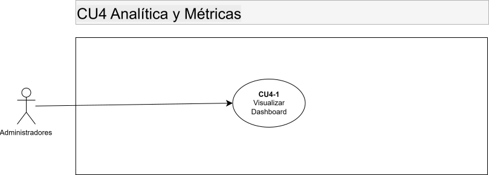

# Diagramas de Casos de Uso del Sistema: Expandidos
## Sistema de Gestión de Conocimiento (SGC) - Info Hub

Al expandir los casos de uso identificados en el Diagrama de Primera Descomposición, se obtuvieron un total de **21 casos de uso expandidos**.

Estos casos detallan las distintas interacciones entre actores y el sistema, abarcando la gestión completa del ciclo de vida de activos intelectuales, búsqueda y recomendaciones, integración con sistemas externos, analítica de métricas y administración de usuarios.

Para mejorar la organización y comprensión, los 21 casos de uso se agrupan en **5 categorías funcionales** que se emplearon en la primera descomposición.

Cada categoría incluye un listado de los casos que la conforman y un espacio donde se colocará el diagrama en formato `.svg`.

---

## 1. Almacenamiento y Clasificación

**Descripción:** Gestión completa del ciclo de vida de activos intelectuales, desde la creación de borradores hasta la publicación y retiro, incluyendo procesos de validación y revisión.

---

## 2. Búsqueda y Recomendaciones

**Descripción:** Sistema de recuperación de información que permite búsquedas por coincidencias de título y tags, visualización de activos, descarga de archivos y recomendaciones inteligentes basadas en metadatos.

---

## 3. Conexión con Otros Sistemas

**Descripción:** Exposición de APIs REST públicas para permitir que sistemas externos (universidades aliadas, socios comerciales) consuman información de activos públicos en formato JSON sin autenticación.

**Casos incluidos:**

---

## 4. Analítica y Métricas

**Descripción:** Sistema de monitoreo y visualización de métricas en tiempo real para medir el retorno de inversión del capital intelectual, incluyendo descargas, visitas únicas y citas bibliográficas.

---

## 5. Gestión de Usuarios

**Descripción:** Administración completa de usuarios del sistema, incluyendo registro público, gestión de perfiles, creación de usuarios por roles específicos y control de estados (activo/bloqueado).

## 6. Suscripciones y Alertas de Conocimiento

**Descripción:** Gestión de suscripciones y alertas de conocimiento del sistema, permitiendo que los usuarios se 
suscriban a temas de interés (tags, autores, colecciones) y reciban notificaciones automáticas cuando 
se publiquen nuevos activos relevantes, respetando niveles de confidencialidad y permisos.

