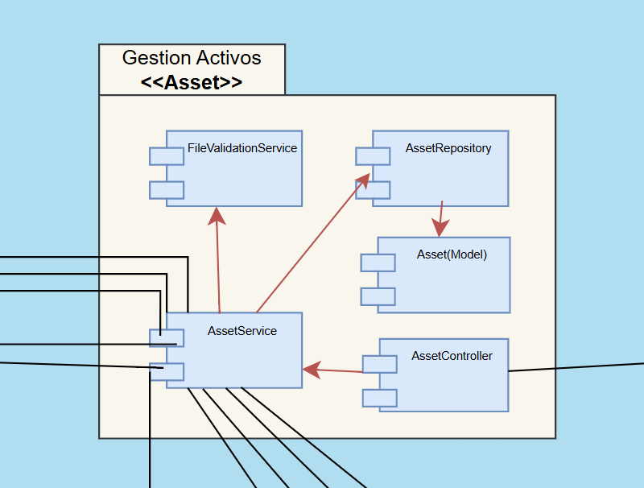
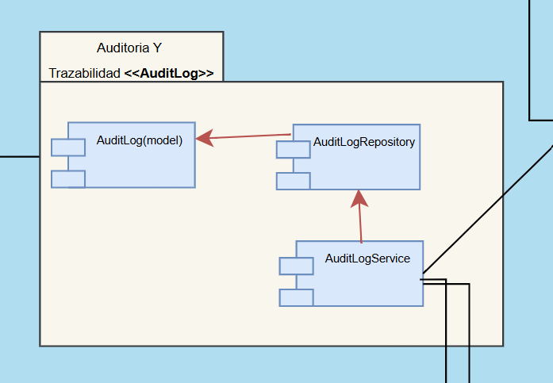
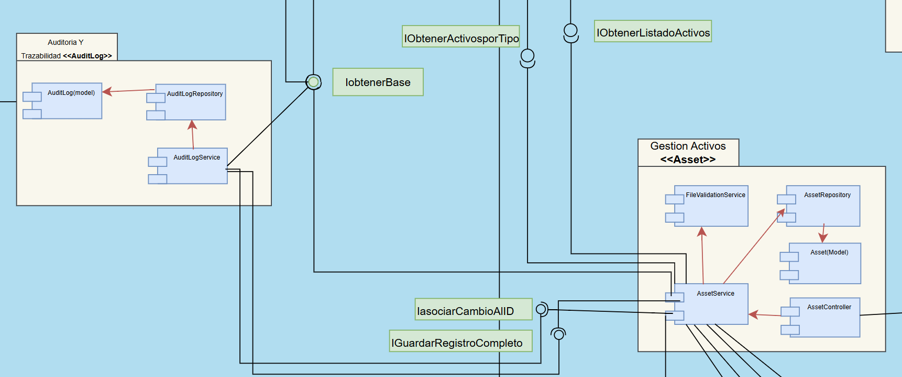

# Diagrama de Despliegue: Componentes + Distribucion

## Conceptos clave

- **Componente:** unidad de software con responsabilidades claras.
- **Interfaz:** contrato de comunicacion. Provista `○`, requerida `⌓`.
- **Diagrama de componentes:** muestra componentes e interfaces.
- **Diagrama de distribucion:** muestra nodos fisicos/logicos.
- **Diagrama de despliegue:** une el diagrama de componentes y el de distribucion.

## Arquitectura usada en el ejemplo

El backend trabaja con arquitectura en capas y patron MVC:

- **Controller:** capa de entrada/salida HTTP; valida request y arma la respuesta.
- **Service:** aplica reglas y coordina repositorios.
- **Repository:** encapsula consultas a BD.
- **Model:** representa entidades del dominio y sus datos.

> Este esquema muestra como se hará la implementación en el código real.
> Mostrando los componentes que se trasformarán en archivos, las interfaces, quien la consuma y quien la expone, de forma que al analizarlo podamos ubicarlas en el código


Draw.io: [LINK_DRAWIO](https://drive.google.com/file/d/1qFH4Zdvp-0QB7WfUQrvbfp9JK4GQUxIA/view?usp=sharing)


## Como se refleja en el codigo

En el proyecto, cada componente se materializa en paquetes con **controller**, **service**, **repository** y **model** (cuando aplica). Esto permite que el diagrama de despliegue tenga una relacion directa con la estructura del codigo y sus responsabilidades.

## Componentes del ejemplo

Se usan dos componentes porque muestran trazabilidad completa con auditoria y son faciles de rastrear en codigo:

- **Asset**: gestiona activos y cambios de estado.
- **AuditLog**: persiste y consulta la bitacora de cambios.

| Componente | Rol | Responsabilidad | Paquetes clave |
|---|---|---|---|
| Asset | Gestion | Modificar activos y solicitar registro de cambios. | controller, service, repository, model |
| AuditLlog | Auditoria | Guardar y consultar registros de cambios. | service, repository, model |





## Interfaces entre los componentes

- **IasociarCambioAlID**
  - Proposito: vincular un cambio con el identificador del activo.
  - Provee: `AuditLog`.
  - Requiere: `Asset`.

- **IGuardarRegistroCompleto**
  - Proposito: persistir el registro completo de auditoria.
  - Provee: `AuditLog`.
  - Requiere: `Asset`.



### UML en texto (componentes + interfaces)

```
[Asset]  ⌓ IasociarCambioAlID  ○  [AuditLog]
[Asset]  ⌓ IGuardarRegistroCompleto  ○  [AuditLog]
```

## Trazabilidad con Requerimientos

| Interfaz | RF relacionado | CU relacionado | EAC relacionado |
|---|---|---|---|
| IasociarCambioAlID | RF-1-7-1 | CU1-7 Registrar Cambio | EAC-6 |
| IGuardarRegistroCompleto | RF-1-7-7 | CU1-7 Registrar Cambio | EAC-6 |
| IGuardarRegistroCompleto | RF-1-3-5 | CU1-3 Gestionar Borrador | EAC-6 |

## Relacion con la implementacion

El ejemplo de codigo en la carpeta de implementacion refleja este mismo diagrama. Los servicios de `Asset` consumen las interfaces provistas por `AuditLog` para registrar cambios y consultar historial.

## Archivos por componente 

### Asset (gestion de activos)

- `AssetController.ts`
- `AssetService.ts`
- `AssetRepository.ts`
- `Asset.ts`
- `FileValidationService.ts`

**Implementa:** `IActuailzarAsset`, `IAccederActivoPendiente`, `IAccederListaActivosPendientes`, `IEnviarActivoRevisores`, `IObtenerActivosPorTipo`, `IObtenerListadoActivos`, `IActivosPublicados`, `IObtenerActivoRuta`.

**Consume:** `IGuardarRegistroCompleto`, `IasociarCambioAlID`, `ILastLog`, `IobtenerBase`.

### audit-log (auditoria y trazabilidad)

- `AuditLogService.ts`
- `AuditLogRepository.ts`
- `AuditLog.ts`

**Implementa:** `IGuardarRegistroCompleto`, `IasociarCambioAlID`, `ILastLog`.

**Consume:** `IobtenerBase`.

## Interfaces del sistema (provee y consume)

| Interfaz | Provee | Consume | Proposito |
|---|---|---|---|
| IApiMetrics | analytic-metrics | search | Exponer metricas de consumo de endpoints publicos. |
| IObtenerActivosPorTipo | assets | api-public | Filtrar activos por tipo. |
| IobtenerBase | BD | assets, audit-log | Acceso a la fuente principal de datos. |
| IasociarCambioAlID | audit-log | assets | Vincular un cambio con el identificador del activo. |
| IGuardarRegistroCompleto | audit-log | assets | Persistir el registro completo de auditoria. |
| IActuailzarAsset | assets | - | Actualizar metadatos o estado de un activo. |
| IAccederActivoPendiente | assets | review | Acceder a activos en estado En Revision. |
| IEnviarActivoRevisores | assets | review | Cambiar estado a En Revision y notificar. |
| IAccederListaActivosPendientes | assets | review | Listar activos pendientes de revision. |
| IObtenerUsuarioId | users | cualquier componente | Obtener ID del usuario autenticado. |
| IEnviarARevisoresNuevoActivo | assets | review | Flujo completo de envio a revision. |
