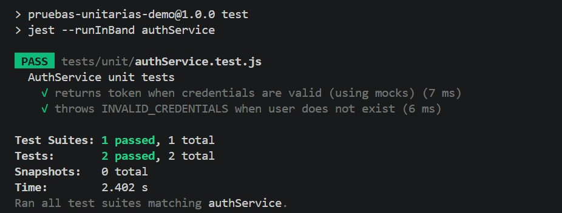
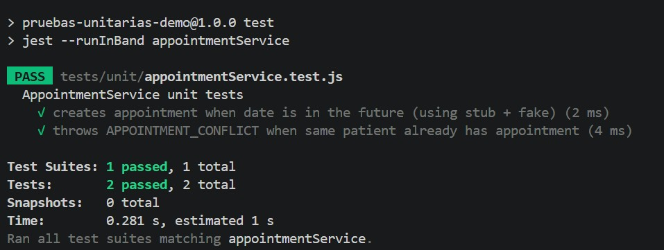

# Documentación de Pruebas Unitarias - AuthService & AppointmentService

**Ubicación de tests:** `Pruebas-Unitarias/Ejemplo_Node/tests/unit/`

---

## AuthService Tests (2 tests)

**Comando para ejecutar ambos:**
```bash
npm test -- authService
```

---

## Test 1: AuthService - Login Exitoso

### Caso de Prueba
**Descripción:** Valida que un usuario con credenciales correctas recibe un token JWT sin conectarse a una base de datos real.

**Entrada:**
- email: "test@demo.com"
- password: "secret"

**Técnicas utilizadas:**
- Mocks de dependencias (userRepo, passwordHasher, tokenService)
- Patrón Arrange-Act-Assert

**Datos de prueba:**
- userRepo.findByEmail() → devuelve usuario con id=10, role="student"
- passwordHasher.compare() → retorna true
- tokenService.sign() → genera "token-abc"

### Resultado Esperado
```
PASS  tests/unit/authService.test.js
  AuthService unit tests
    √ returns token when credentials are valid (using mocks) (7 ms)
    √ throws INVALID_CREDENTIALS when user does not exist (6 ms)

Test Suites: 1 passed, 1 total
Tests:       2 passed, 2 total
Snapshots:   0 total
Time:        2.402 s
```

### Resultado Obtenido


---

## Test 2: AuthService - Login Fallido (Usuario No Existe)

### Caso de Prueba
**Descripción:** Valida que el sistema rechaza la autenticación cuando el usuario no existe en la base de datos, previniendo ataques de enumeración con un mensaje genérico.

**Entrada:**
- email: "missing@demo.com"
- password: "123"

**Técnicas utilizadas:**
- Mock que devuelve null (usuario no encontrado)
- Validación de excepciones con rejects.toThrow()

**Datos de prueba:**
- userRepo.findByEmail() → devuelve null

### Resultado Esperado
```
PASS  tests/unit/authService.test.js
  AuthService unit tests
    √ returns token when credentials are valid (using mocks) (7 ms)
    √ throws INVALID_CREDENTIALS when user does not exist (6 ms)

Test Suites: 1 passed, 1 total
Tests:       2 passed, 2 total
Snapshots:   0 total
Time:        2.402 s
```

### Resultado Obtenido


Ver Test 1 arriba - ambos tests se ejecutan en la misma corrida.

---

## AppointmentService Tests (2 tests)

**Comando para ejecutar ambos:**
```bash
npm test -- appointmentService
```

---

## Test 3: AppointmentService - Crear Cita Exitosamente

### Caso de Prueba
**Descripción:** Valida que una cita futura sin conflictos se guarda correctamente en el repositorio sin acceder a una base de datos real.

**Entrada:**
- patientId: 33
- startsAt: "2026-03-23T11:00:00.000Z"

**Técnicas utilizadas:**
- Fake Repository: simulación en memoria de la base de datos
- Clock Stub: reloj fijo para pruebas determinísticas
- Patrón Arrange-Act-Assert

**Datos de prueba:**
- Fake Repo: vacío inicialmente
- Clock Stub: ahora="2026-03-23T10:00:00.000Z" (1 hora antes)
- Cita requerida: 1 hora en el futuro (válida)

### Resultado Esperado
```
PASS  tests/unit/appointmentService.test.js
  AppointmentService unit tests
    √ creates appointment when date is in the future (using stub + fake) (5 ms)
    √ throws APPOINTMENT_CONFLICT when same patient already has appointment (4 ms)

Test Suites: 1 passed, 1 total
Tests:       2 passed, 2 total
Snapshots:   0 total
Time:        2.634 s
```

### Resultado Obtenido


---

## Test 4: AppointmentService - Detectar Conflicto de Citas

### Caso de Prueba
**Descripción:** Valida que el sistema rechaza cuando un paciente intenta agendar una cita en la misma hora que ya tiene una cita preexistente, previniendo overbooking.

**Precondición:**
- Fake Repo contiene cita existente: { id: 1, patientId: 33, startsAt: "2026-03-23T11:00:00.000Z" }

**Entrada:**
- patientId: 33
- startsAt: "2026-03-23T11:00:00.000Z" (MISMA HORA que cita existente)

**Técnicas utilizadas:**
- Fake Repository precargado con datos conflictivos
- Método hasConflict() para detección de colisiones
- Validación de excepciones

**Datos de prueba:**
- Clock Stub: ahora="2026-03-23T10:00:00.000Z"
- Cita existente: con mismo patient ID y misma hora

### Resultado Esperado
```
PASS  tests/unit/appointmentService.test.js
  AppointmentService unit tests
    √ creates appointment when date is in the future (using stub + fake) (5 ms)
    √ throws APPOINTMENT_CONFLICT when same patient already has appointment (4 ms)

Test Suites: 1 passed, 1 total
Tests:       2 passed, 2 total
Snapshots:   0 total
Time:        2.634 s
```

### Resultado Obtenido


Ver Test 3 arriba - ambos tests se ejecutan en la misma corrida.

---

## Resumen de Tests

| Numero | Archivo | Test | Comando de Ejecucion | Status |
|--------|---------|------|----------------------|--------|
| 1 y 2 | authService.test.js | Ambos tests AuthService | npm test -- authService | PASS |
| 3 y 4 | appointmentService.test.js | Ambos tests AppointmentService | npm test -- appointmentService | PASS |

**Nota:** Los tests se corren en pares:
- Tests 1 y 2 se ejecutan juntos con `npm test -- authService`
- Tests 3 y 4 se ejecutan juntos con `npm test -- appointmentService`

---

## Ejecucion General de Todos los Tests

```bash
npm test
```

Resultado esperado:
```
Test Suites: 3 passed, 3 total
Tests:       7 passed, 7 total
Snapshots:   0 total
Time:        ~2.6s
```


 