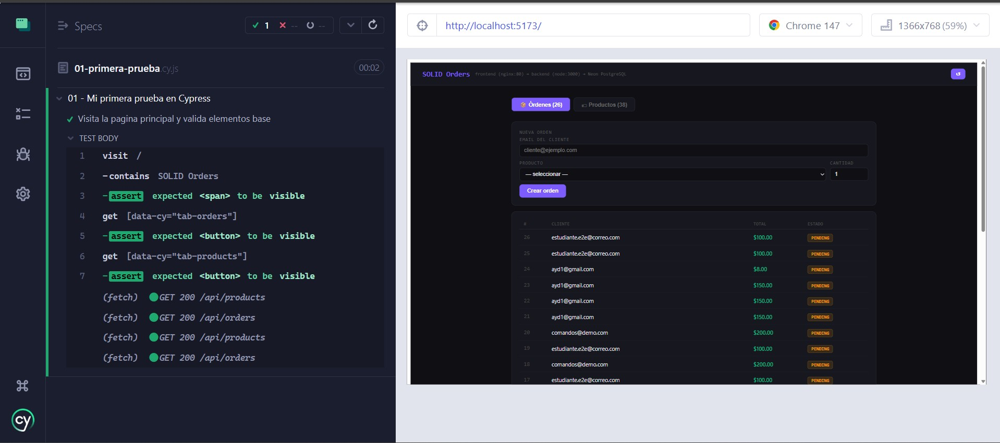
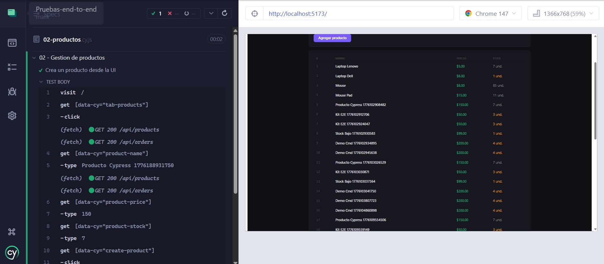
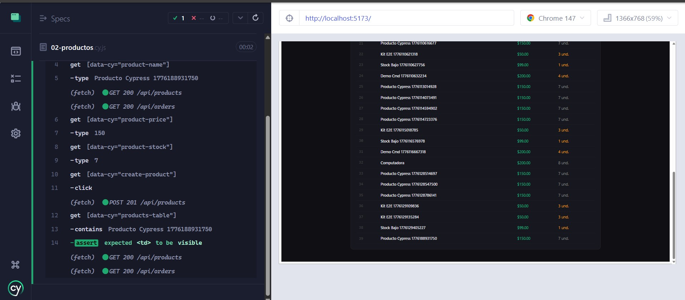
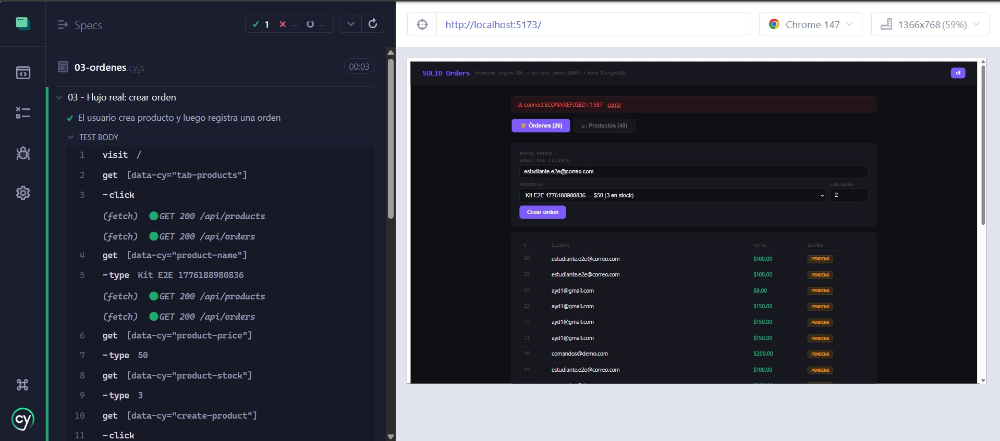
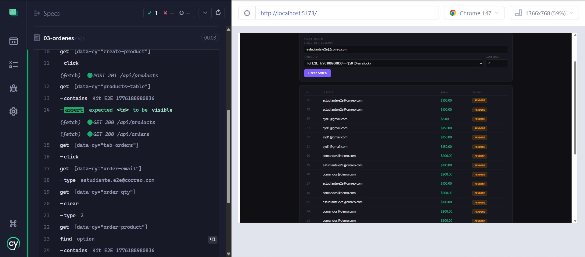
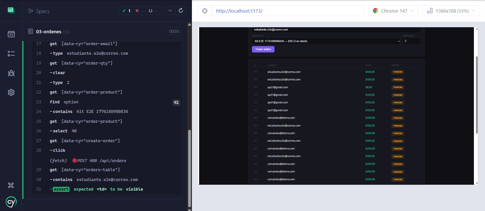
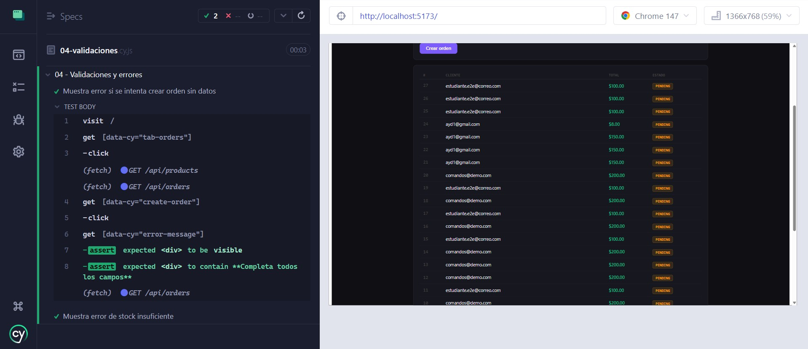
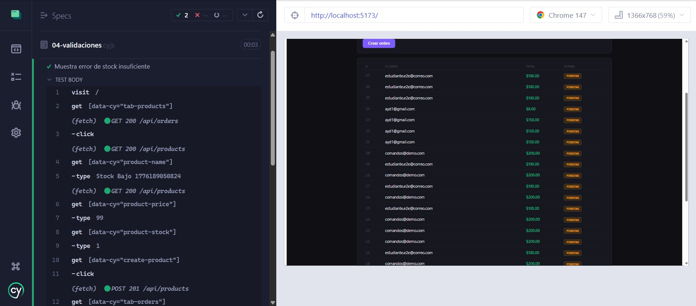
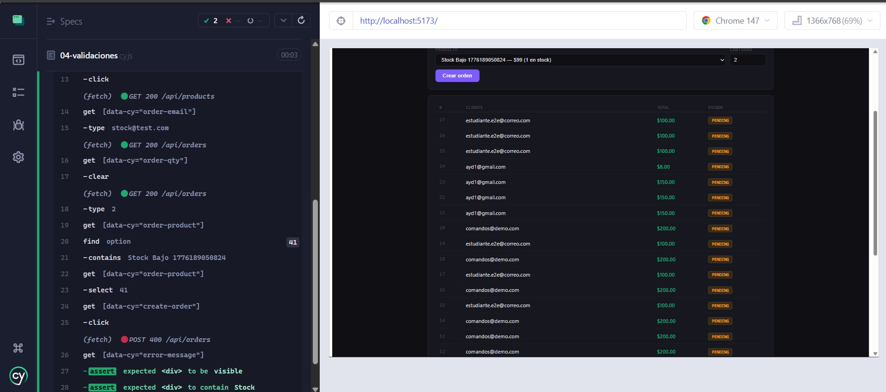

# Documentación de Pruebas End-to-End - Proyecto

Pruebas end-to-end ejecutadas con Cypress para validar flujos completos de la aplicación.

**Ubicación:** `Pruebas-end-to-end/cypress/e2e/`

---

## Prueba 1: Verificación de Carga

**Código:** [01-primera-prueba.cy.js](../../cypress/e2e/01-primera-prueba.cy.js)

**Descripción:**
Valida que la aplicación carga correctamente desde la URL base. Verifica que los elementos principales (título "SOLID Orders", tabs de productos y órdenes) sean visibles sin errores HTTP.

**Captura de ejecución:**


---

## Prueba 2: CRUD Básico - Crear Producto

**Código:** [02-productos.cy.js](../../cypress/e2e/02-productos.cy.js)

**Descripción:**
Crea un producto desde la interfaz: navega al tab de productos, llena el formulario con nombre único, precio y stock, y valida que el producto aparezca inmediatamente en la tabla. Prueba la integración completa entre UI y backend.

**Captura de ejecución:**




---

## Prueba 3: Flujo Completo - Crear Producto y Orden

**Código:** [03-ordenes.cy.js](../../cypress/e2e/03-ordenes.cy.js)

**Descripción:**
Prueba un flujo real de negocio: crea un producto, lo valida en la tabla, luego crea una orden asociada a ese producto y paciente. Valida transacciones complejas con múltiples entidades.

**Captura de ejecución:**




---

## Prueba 4: Validaciones y Casos Negativos

**Código:** [04-validaciones.cy.js](../../cypress/e2e/04-validaciones.cy.js)

**Descripción:**
Valida dos casos de error comunes: intenta crear producto sin llenar nombre (falla validación), e intenta crear orden sin stock disponible (falla lógica de negocio). Verifica que los mensajes de error sean mostrados correctamente.

**Captura de ejecución:**




---

## Resumen

| Numero | Archivo | Test | Tipo |
|--------|---------|------|------|
| 1 | 01-primera-prueba.cy.js | Carga de aplicación | Smoke |
| 2 | 02-productos.cy.js | Crear producto | CRUD |
| 3 | 03-ordenes.cy.js | Producto + Orden | Flujo |
| 4 | 04-validaciones.cy.js | Errores comunes | Negativo |

---

## Ejecución

Desde el directorio `Pruebas-end-to-end/`:

```bash
# Modo gráfico (desarrollo/visualización)
npm run cy:open

# Modo headless (CI/CD)
npm run test:e2e

# Test específico
npx cypress run --spec "cypress/e2e/02-productos.cy.js"
```
